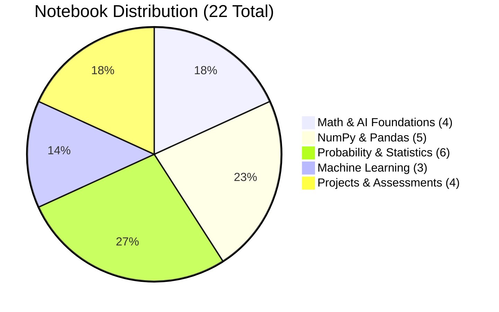
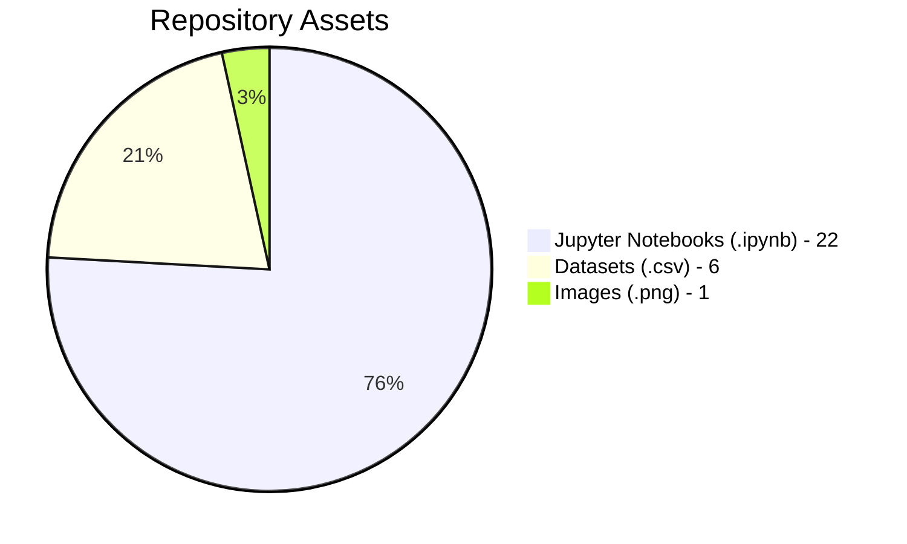
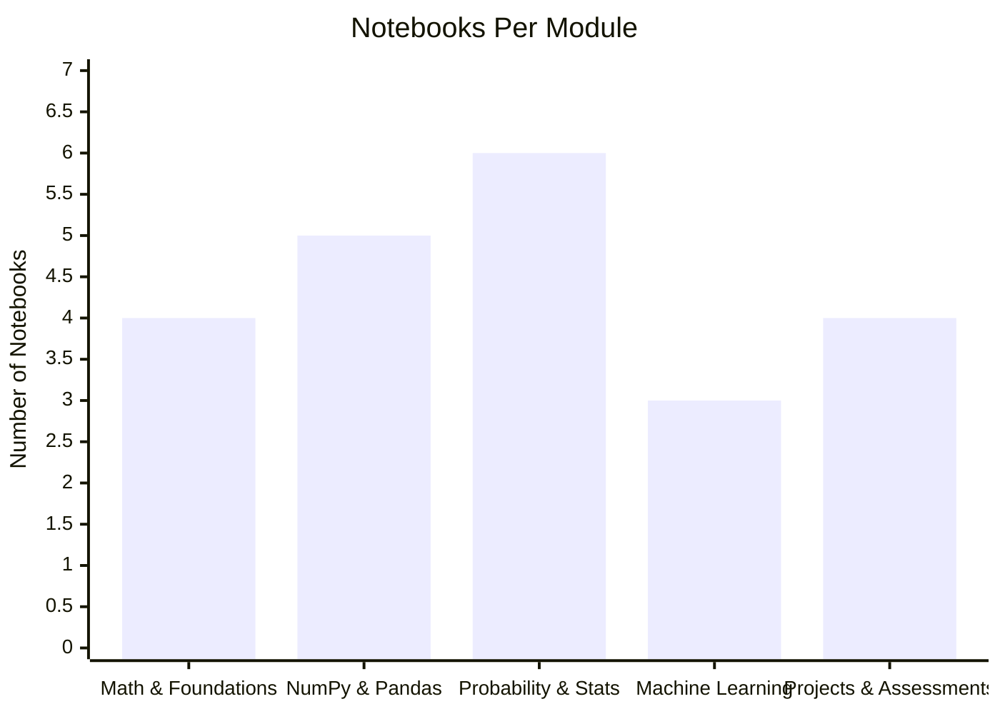
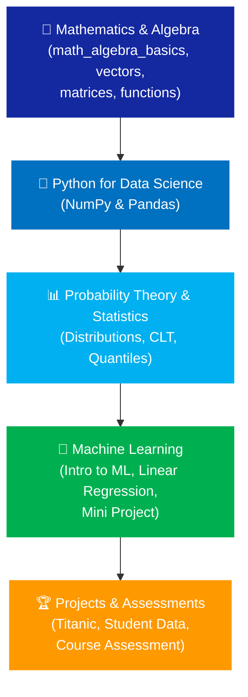
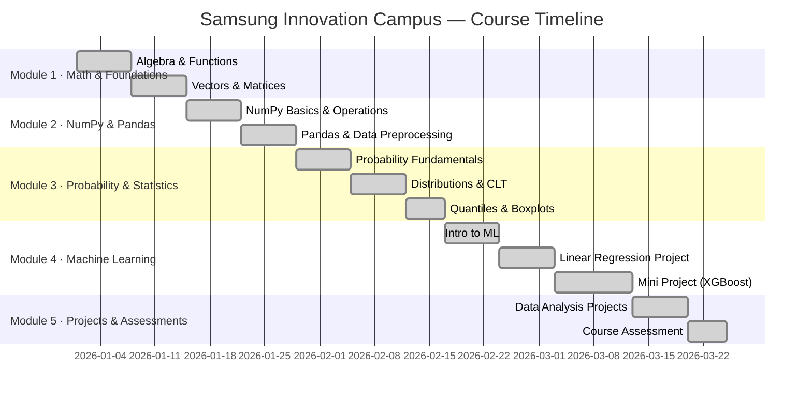
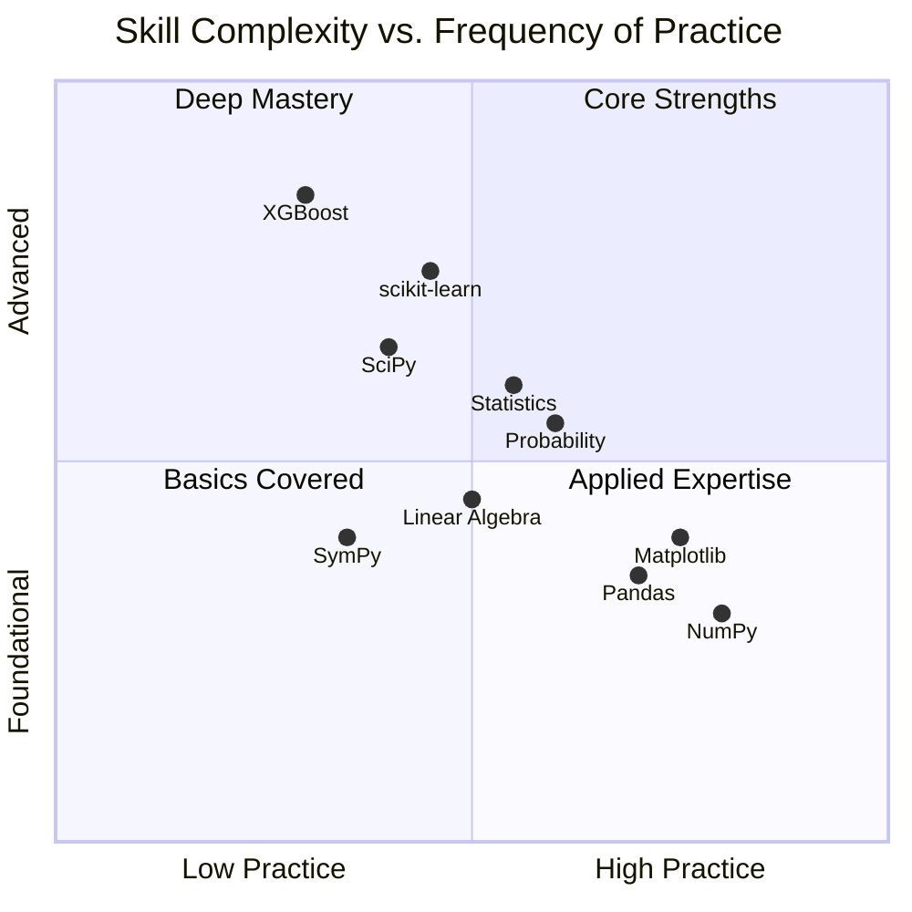
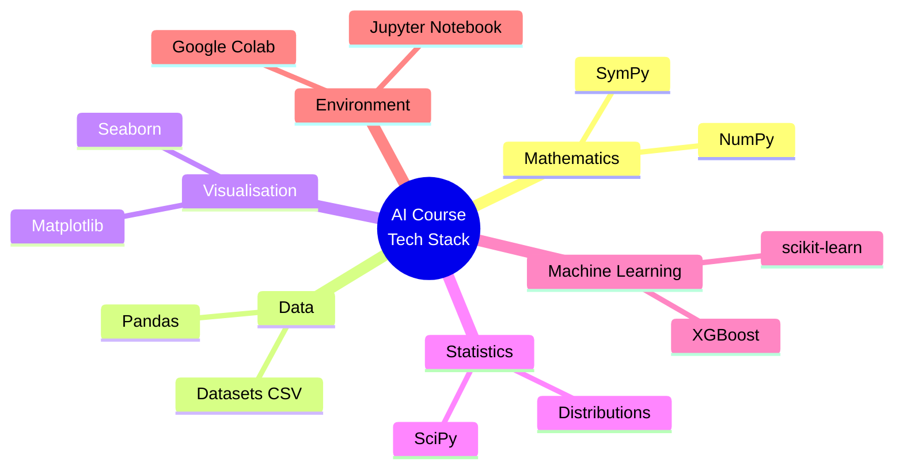

# Samsung Innovation Campus — AI Course Showcase

This repository is a comprehensive showcase of hands-on work completed during the **Samsung Innovation Campus AI course**. It documents a full learning journey — from mathematical foundations and Python programming fundamentals through probability & statistics, all the way to real-world machine learning projects. Every notebook reflects a specific topic or assignment from the course curriculum.

<p align="center">
  
</p>

---

## GitHub stats

<p align="center">


</p>

---

## Repository activity

<p align="center">
  
</p>

> **Live contribution heatmap** powered by [Repobeats](https://repobeats.axiom.co/).

---

## Repository visual metrics

### Notebook coverage by course track



### Asset composition in this repository



### Notebooks per module (bar chart)



---

## Learning pathway overview

This course follows a carefully structured progression:



Each module builds on the previous one, ensuring a solid conceptual base before tackling applied machine learning.

---

## Course timeline



---

## Skill progression



---

## Module 1 — Math & AI Foundations

These notebooks cover the mathematical concepts that underpin machine learning: algebra, functions, vectors, and matrices.

---

### `math_algebra_basics.ipynb` — Algebraic Functions in Python

This notebook introduces symbolic mathematics in Python using the **SymPy** library. It bridges the gap between abstract algebra and practical computation.

**Topics covered:**
- First-degree (linear) equations — solving for unknowns (e.g., `2x + 5 = 15`)
- Quadratic equations — solving and interpreting roots
- Polynomial expansion — e.g., expanding `(x − 2)³`
- Simplification of algebraic expressions
- Sequences — arithmetic and geometric sequence concepts
- User input handling for dynamic equation solving
- Introduction to SymPy's `symbols`, `solve`, `expand`, and `simplify` functions

---

### `math_functions_in_python.ipynb` — Basic Use of Python Libraries

An introduction to the core Python data science stack as applied to mathematical problem-solving, with a light AI modelling example.

**Topics covered:**
- **NumPy** — array creation, numerical operations, computing means
- **Pandas** — creating DataFrames, reading tabular data, performing column operations
- **Matplotlib** — basic data visualization and plotting
- Lambda functions for concise data transformations
- Student result and attendance analysis as a worked example
- Overview of a simple AI model pipeline

---

### `vectors_in_python.ipynb` — Vectors for Machine Learning

A thorough treatment of vectors from a machine learning perspective — building intuition for how data is represented and compared in high-dimensional space.

**Topics covered:**
- Row vectors and column vectors — definitions and representations
- Vector addition (element-wise operations)
- Scalar multiplication (scaling vectors)
- Dot product — formula and computation (e.g., `[1,2,3] · [4,5,6] = 32`)
- Vector magnitude — L2 Norm calculation
- Cosine similarity — measuring angular distance between vectors; application in recommendation systems
- Euclidean distance — measuring straight-line distance
- K-Means clustering — using vectors to group similar data points
- Real-world applications: game physics engines, time series analysis, recommendation systems

---

### `matrix_functions_and_differentiation.ipynb` — Basic Matrix Operations

Covers the linear algebra concepts essential for understanding neural networks and optimization: matrix manipulations, eigenvalues, and calculus differentiation.

**Topics covered:**
- Matrix creation using NumPy — zeros matrices, ones matrices, random matrices
- Eigenvalues (λ) — definition and computation: scalar values in linear transformations
- Eigenvectors — non-zero vectors satisfying `Av = λv`
- Matrix transformations — applying linear transformations to vectors
- Differentiation — symbolic and numerical calculus using Python
- Practical applications of eigendecomposition in data science

---

## Module 2 — NumPy & Pandas for Data Science

These notebooks build hands-on proficiency with the two most important Python libraries for data manipulation and analysis.

---

### `numpy_basics.ipynb` — NumPy Basics

A ground-up introduction to NumPy arrays, covering construction, properties, and manipulation.

**Topics covered:**
- Creating arrays from Python lists, tuples, dictionaries, sets, and ranges
- Array properties — `.shape`, `.size`, `.ndim`
- Array generation utilities — `np.linspace()`, `np.zeros()`, `np.ones()`, `np.arange()`
- Data type inspection and conversion with `.astype()`
- Reshaping arrays — changing dimensions without altering data
- Random array generation — `np.random`
- Appending and deleting elements in 1D and 2D arrays
- Performance comparison between NumPy arrays and plain Python lists

---

### `numpy_operations.ipynb` — NumPy Operations

Focuses on applying NumPy to realistic employee data, demonstrating data extraction, filtering, and summarisation.

**Topics covered:**
- Loading structured data from a CSV file (`datasets/Emp_data.csv`) using `np.genfromtxt()`
- Separating numeric columns from categorical columns
- Computing summary statistics — mean, median, standard deviation
- Salary filtering — extracting employees above/below a threshold
- Data segmentation — categorising employees by salary band
- Practical data wrangling patterns used before Pandas becomes available

---

### `numpy_practice_questions.ipynb` — NumPy Practice Questions

A set of practice exercises reinforcing the NumPy skills from earlier notebooks.

**Topics covered:**
- Creating arrays with `np.linspace()` and `np.arange()`
- Array reshaping and dimension manipulation exercises
- Type casting with `.astype()`
- Array indexing and slicing
- Array deletion and in-place modification
- Step-by-step worked solutions to common exam-style questions

---

### `pandas_basics.ipynb` — Operations in Pandas

A systematic walkthrough of the most important Pandas operations for constructing, accessing, and modifying DataFrames.

**Topics covered:**
- Creating DataFrames from Python dictionaries with custom indices
- Accessing rows and columns — `iloc[]`, `loc[]`, column name selection
- Dropping rows and columns — `drop()` with `axis` parameter
- Extracting single values by position or label
- Boolean indexing — filtering rows based on conditions
- Renaming columns and index labels — `rename()` with `inplace` parameter
- Multi-column selection and slicing

---

### `data_preprocessing.ipynb` — Data Preprocessing in Python

Covers the critical data cleaning steps that must happen before any machine learning model can be trained reliably.

**Topics covered:**
- Identifying and handling **missing data (NaN values)** — detecting nulls with `.isnull()`, `.sum()`
- Strategies for missing data — dropping vs. imputation
- Detecting and removing **duplicate rows** — `.duplicated()`, `.drop_duplicates()`
- **Outlier detection and handling** — using statistical thresholds
- Applied to the Titanic dataset (`datasets/titanic.csv`) and a sales dataset (`datasets/data_sales.csv`)
- Data quality assessment as a standard workflow step before modelling

---

## Module 3 — Probability & Statistics

These notebooks provide the statistical foundations necessary for understanding machine learning algorithms, model evaluation, and data interpretation.

---

### `BasicsOfProbability_22_4_26.ipynb` — Basics of Probability

Introduces fundamental counting principles and classical probability through worked problems.

**Topics covered:**
- **Permutations (nPr)** — arrangements where order matters; formula: `P(n,r) = n! / (n−r)!`
- **Combinations (nCr)** — selections where order does not matter; formula: `C(n,r) = n! / (r!(n−r)!)`
- The **fundamental counting principle**
- Real-world applications:
  - Reading list ordering problems
  - Student council selection
  - Luggage lock combinations
  - Pizza topping selections
  - Lottery probability problems
  - Executive board assignment scenarios
- Classical probability (Urn & Ball problems)

---

### `practice_random_variables.ipynb` — Random Variables

Covers the theoretical and practical aspects of random variables, a cornerstone of probabilistic reasoning in AI.

**Topics covered:**
- **Discrete random variables** — definition, examples (e.g., number of heads in coin tosses)
- **Continuous random variables** — definition, examples (e.g., bus waiting time)
- **Probability Mass Function (PMF)** — discrete probability distributions
- **Probability Density Function (PDF)** — continuous probability distributions
- **Cumulative Distribution Function (CDF)** — computing and interpreting cumulative probabilities
- **Expected value (mean)** — computing E[X] for discrete and continuous variables
- **Variance and standard deviation** — measuring spread
- Simulation of random processes with 10,000 repetitions using NumPy
- Normal distribution modelling of real-world data

---

### `practice_continuous_probability_distributions.ipynb` — Continuous Probability Distributions

A hands-on exploration of the major continuous probability distributions used throughout statistics and machine learning.

**Topics covered:**
- **Uniform distribution** — equal probability across an interval; PDF and CDF
- **Normal (Gaussian) distribution** — bell curve; mean, standard deviation, 68-95-99.7 rule
- **Exponential distribution** — modelling time between events
- **Chi-square distribution** — used in hypothesis testing and goodness-of-fit tests
- **t-distribution** — for small sample inference
- **F-distribution** — for comparing variances (ANOVA)
- Interpreting and plotting PDFs and CDFs using Matplotlib
- Quantile computation with SciPy
- Practical real-world modelling applications for each distribution

---

### `practice_central_limit_theorem.ipynb` — Central Limit Theorem (CLT)

Demonstrates why the Central Limit Theorem is one of the most important results in all of statistics.

**Topics covered:**
- Statement and intuition of the **Central Limit Theorem**
- Why the sampling distribution of the sample mean becomes normal regardless of population shape
- Simulation of repeated sampling from different underlying distributions (uniform, exponential)
- Effect of increasing **sample size** on the convergence to normality
- Overlay of theoretical normal curve on simulated sampling distributions
- Applications of CLT in data science — confidence intervals, hypothesis testing
- Libraries used: NumPy (simulation), Matplotlib (visualisation), SciPy (theoretical comparison)

---

### `practice_quantiles_boxplot_(1).ipynb` — Quantiles and Box Plots

Covers descriptive statistics tools for understanding data distribution and spotting outliers.

**Topics covered:**
- **Median** — the 50th percentile; robust measure of centre
- **Quartiles** — Q1 (25th), Q2 (50th / median), Q3 (75th percentile)
- **Deciles** — 10th through 90th percentiles in 10% increments
- **Percentiles** — generalised quantile concept
- **Interquartile Range (IQR)** — `IQR = Q3 − Q1`; used for outlier detection
- **Five-number summary** — minimum, Q1, median, Q3, maximum
- **Box plot** — visualising distribution shape, spread, and outliers
- Outlier identification using the `1.5 × IQR` rule
- Computing all of the above using NumPy and Matplotlib

---

### `ex_0402.ipynb` — Coding Exercise: Continuous Distributions

A focused coding exercise on computing probabilities and quantiles for specific continuous distributions.

**Topics covered:**
- Probability density at specific values for various distributions
- **Uniform distribution** — specifying parameters `a` and `b`
- **Normal distribution** — computing PDF and quantile values
- **Chi-square distribution** — degree-of-freedom parameter analysis
- Quantile computation at multiple alpha levels (α = 0.05, 0.10, etc.)
- Using `scipy.stats` functions alongside Matplotlib visualisations

---

## Module 4 — Machine Learning

These notebooks introduce the full machine learning workflow — from loading data to training models and evaluating performance.

---

### `IntroductionToML_27_4_26.ipynb` — Introduction to Machine Learning

Provides a practical first encounter with scikit-learn and the machine learning pipeline.

**Topics covered:**
- Loading the **breast cancer dataset** from `sklearn.datasets`
- Creating Pandas DataFrames from sklearn dataset objects
- Exploring dataset features and target labels
- **Train-test split** — finding the optimal split ratio experimentally
- Model evaluation metrics — accuracy scoring
- Overview of the end-to-end ML pipeline: data → model → evaluation

---

### `Startup_Linear_Regression_Model_28_4_26.ipynb` — Startup Linear Regression Model

A complete, real-world linear regression workflow from raw CSV data to a trained predictive model.

**Topics covered:**
- **Data import** — reading `datasets/50_Startups.csv` with Pandas
- **Data exploration** — `.head()`, `.info()`, `.describe()`, checking for nulls and duplicates
- **Data cleaning** — handling missing values and duplicates
- **Feature engineering** — applying `OneHotEncoding` to categorical variables (the "State" column)
- **Dummy variable trap** — using `drop='first'` to prevent multicollinearity
- **Train-test split** — splitting data for unbiased model evaluation
- **ColumnTransformer** — combining preprocessing steps for numeric and categorical features
- **Linear Regression** — training with `sklearn.linear_model.LinearRegression`
- **Model evaluation** — generating predictions and assessing model performance

---

### `samsung_mini_project.ipynb` — Hybrid Population Forecasting

The major mini-project of the course: a sophisticated hybrid model combining classical demographic theory with modern machine learning.

**Full title:** *A Hybrid Approach to Population Forecasting: Fusing Geometric Progression with Gradient Boosting Strategies*

**Topics covered:**
- **Geometric Progression demographic modelling** — classical population growth models
- **Gradient Boosting (XGBoost)** — modern ensemble ML for sequence forecasting
- **Exploratory Demographic Analysis (EDA)** — visualising longitudinal population trends
- **Growth rate distributions** — analysing birth rates, death rates, and income indices
- **Sliding window feature engineering** — 5-year window mechanism for temporal features
- **Feature importance analysis** — identifying which demographic factors drive predictions
- Theoretical foundations:
  - Ehrlich (1968) population theory vs. Thompson Demographic Transition theory
  - Wang & Lee (2021) forecasting strategy
  - Barro (1991) linkage between population and economic growth
- Hybrid model combining classical and ML approaches into a unified forecasting pipeline

---

## Module 5 — Projects & Assessments

Practice notebooks, data analysis projects, and formal course assessments.

---

### `titanic_data_analysis.ipynb` — Titanic Dataset Analysis

An exploratory data analysis project using the famous Titanic passenger dataset.

**Topics covered:**
- Loading and inspecting data with `.head()`, `.tail()`, `.info()`
- Accessing column names and index range
- **Single and multi-column selection** — selecting one or more columns by name
- **Position-based selection** — `iloc[]` for row and column slicing
- **Label-based selection** — `loc[]` for named row and column access
- **Extracting scalar values** — accessing a specific cell by position or label
- **Column renaming** — using `rename()` with and without `inplace=True`
- Understanding dataset structure before proceeding to preprocessing and modelling

---

### `student_data_analysis.ipynb` — Student Data Analysis

Analyses a student records dataset to practise data extraction and manipulation.

**Topics covered:**
- Loading structured student records from `datasets/Student.csv` using `np.genfromtxt()`
- Converting raw NumPy arrays to Pandas DataFrames
- Multi-column data handling — working with records that contain multiple attributes
- Column extraction and data filtering operations
- Visualising student data trends using Matplotlib
- Applying linear regression (`sklearn`) to model relationships in student data

---

### `mini_project_foundations.ipynb` — Basic Math & Data Visualization Dashboard

A creative mini-project that unifies mathematical concepts with interactive data visualisation.

**Topics covered:**
- **Algebra & Sequence Visualisation** — plotting algebraic functions and arithmetic sequences
- **Quadratic plotting** — graphing parabolas and analysing their properties
- **Dynamic Math Dashboard** — building a multi-panel visualisation using Matplotlib subplots
- **Interactive Dataset Explorer** — loading and visualising datasets on demand
- Integration of NumPy, Pandas, and Matplotlib into a cohesive application
- Dashboard-style presentation of mathematical and data science concepts

---

### `samsung_course_assessment.ipynb` — Samsung Course Assessment

A formal course assessment covering vector operations, feature extraction, and linear algebra applications.

**Topics covered:**
- **Vector operations** — representing product prices and quantities as NumPy vectors
- **Dot product** — computing total order amounts as the dot product of price and quantity vectors
- **Feature extraction** — selecting and analysing specific features from a housing dataset
- **Linear systems (Ax = b)** — setting up and solving systems of linear equations
- Housing dataset features: CRIM, NOX, RM, AGE
- Demonstrating real-world applications of linear algebra in data science

---

## Datasets

All datasets are stored in the `datasets/` folder.

| File | Used In | Description |
|------|---------|-------------|
| `datasets/50_Startups.csv` | `Startup_Linear_Regression_Model_28_4_26.ipynb` | Startup company financials — R&D spend, admin spend, marketing spend, state, and profit |
| `datasets/Emp_data.csv` | `numpy_operations.ipynb` | Employee records with numeric and categorical columns for salary analysis |
| `datasets/House.csv` | `samsung_course_assessment.ipynb` | Housing dataset with features such as CRIM, NOX, RM, AGE for regression |
| `datasets/Student.csv` | `student_data_analysis.ipynb` | Student records for data extraction and analysis exercises |
| `datasets/data_sales.csv` | `data_preprocessing.ipynb` | Sales data used for data cleaning and preprocessing practice |
| `datasets/titanic.csv` | `titanic_data_analysis.ipynb`, `data_preprocessing.ipynb` | Titanic passenger records — survival, class, age, fare, and more |

---

## Tech stack

| Category | Tools |
|----------|-------|
| **Language** | Python 3 |
| **Environment** | Jupyter Notebook / Google Colab |
| **Mathematics** | SymPy |
| **Numerical Computing** | NumPy |
| **Data Manipulation** | Pandas |
| **Visualisation** | Matplotlib, Seaborn |
| **Statistics** | SciPy |
| **Machine Learning** | scikit-learn, XGBoost |



---

## Repository structure

```
SamsungInnovationCampus/
│
├── datasets/                                          # All CSV data files
│   ├── 50_Startups.csv
│   ├── Emp_data.csv
│   ├── House.csv
│   ├── Student.csv
│   ├── data_sales.csv
│   └── titanic.csv
│
├── Prerequisite Classes/                              # All course notebooks
│   ├── math_algebra_basics.ipynb                     # Module 1: Math & Foundations
│   ├── math_functions_in_python.ipynb
│   ├── vectors_in_python.ipynb
│   ├── matrix_functions_and_differentiation.ipynb
│   │
│   ├── numpy_basics.ipynb                            # Module 2: NumPy & Pandas
│   ├── numpy_operations.ipynb
│   ├── numpy_practice_questions.ipynb
│   ├── pandas_basics.ipynb
│   ├── data_preprocessing.ipynb
│   │
│   ├── BasicsOfProbability_22_4_26.ipynb             # Module 3: Probability & Statistics
│   ├── practice_random_variables.ipynb
│   ├── practice_continuous_probability_distributions.ipynb
│   ├── practice_central_limit_theorem.ipynb
│   ├── practice_quantiles_boxplot_(1).ipynb
│   ├── ex_0402.ipynb
│   │
│   ├── IntroductionToML_27_4_26.ipynb                # Module 4: Machine Learning
│   ├── Startup_Linear_Regression_Model_28_4_26.ipynb
│   ├── samsung_mini_project.ipynb
│   │
│   ├── titanic_data_analysis.ipynb                   # Module 5: Projects & Assessments
│   ├── student_data_analysis.ipynb
│   ├── mini_project_foundations.ipynb
│   └── samsung_course_assessment.ipynb
│
├── Samsung-Innovation-Campus.png
└── README.md
```

---

## Run locally

```bash
git clone https://github.com/aadithya-vimal/SamsungInnovationCampus.git
cd SamsungInnovationCampus
pip install numpy pandas matplotlib seaborn scipy sympy scikit-learn xgboost jupyter
jupyter notebook "Prerequisite Classes/"
```

---

## Author

**Aadithya Vimal**  
GitHub: [@aadithya-vimal](https://github.com/aadithya-vimal)
